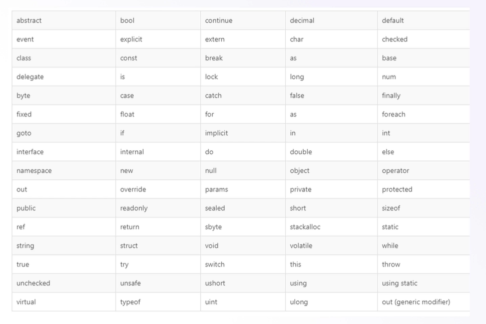

## Namespace

- Enquanto as pastas são as divisões físicas
- Os namesspaces são as divisões lógicas
- Assim como não podemos ter dois arquivos com mesmo nome nas pastas
- Não podemos ter duas classes com mesmo nome em um namespace
- O ideal é ter apenas um namespace e uma classe por arquivo
- O escopo de um namespace é definido entre CHAVES
    - Classes e métodos também
- Um namespace pode ser reutilizado
    - Pode estar presente em diversos arquivos

## Using

- Importações definem as bibliotecas que nosso programa irá utilizar
- Por padrão só o básico vem incluso
- Precisamos importar o que desejamos para poder trabalhar
- Isto é feito no começo do programa
- Utilizamos a palavra reservada `using` para isto

## Variáveis

- Uma variável é algo que utilizamos para armazenar uma informação
- Ser variável significa que seu valor pode ser alterado a qualquer momento
- Sempre que criamos uma variável, dizemos que estamos incializando ela
- Podemos usar um TIPO ou a palavra reservada `var` para criar uma variável
- No C# o tipo vem sempre antes do nome da variável
- Podemos informar um valor já na criação da variável
- Se não informado o valor padrão será aplicado

```c#
    int idade; // Correto inicia com ZERO
    int idade = 25; // Correto inicia com 25
    var idade = 25; // Correto inicia com 25
    var idade; // Errado
```

## Constantes

- Também utilizamos uma constante para armazenar uma informação
- As constantes NÃO PODEM ser alteradas
- Uma vez criadas somo obrigados a atribuir um valor
- Feito isto elas não podem poderão ser modificadas novamente
- Não funcionam com a utilização de var
- São mais otimizadas que as variáveis
- Recomendadas para usos frequentes

```c#
const int IDADE_MINIMA; // Correto inicia com ZERO
const int IDADE_MINIMA = 25; // Correto inicia com 25
const var IDADE_MINIMA = 25; // Errado
const var IDADE_MINIMA; // Errado
```

## Nomes Reservados

- Também chamados de keywords
- São palavras de uso exclusico do C#
- Não podemos utilizar como nomes de variáveis ou constantes
- O VS Code vai te avisar sobre elas

> 

## Comentários

- Em diversos cenários você precisará deixar uma mensagem
- Esta mensagem não deve ser executada pelo programa
- É comum Utilizarmos comentários em linhas que não desejamos executar também
- Podemos ter comentários de:
    - Um linha //
    - Múltiplas linhas /* */
    - XML (Metadata) ///

## Tipos primitivos

- São tipos base cujo outros tipos (Coplexos) irão derivar
- Definir o tipo correto otimiza a execução do programa
- São chamados de Tipo de Valor
- Armazenam o valor e não a referência para um item na memória
- São classificados em:
    - Tipos Simples (Simple Types)
    - Enumeradores (Enums)
    - Estruturas (Structs)
    - Tipos Nulos (Nullable Types)

## System

- No .NET tudo começa de um tipo base chamado `system`
- Todo e qualuqer tipo, seja built-in ou complexo deriva dele
- Ele é a base de todos os objetos no .NET
- Não precisamos nos preocupar em usá-lo ou qualquer coisa similar
- Seu uso já é implícito

## Byte

- O tipo `byte` é utilizado para representar um byte de fato
- Em diversos casos precisamos da cadeia de bytes de um arquivo por exemplo
    - Também chamado de byte array
- Temos também o `sbyte`, que permite valores negativos

> `Signed e Usigned` Valores com sinal "-" por exemplo, são chamados de signed

## Números inteiros

- Números inteiros, ou seja, sem pontuação, podem ser definidos pelos tipos:
    - short/ushort
    - int/uint
    - long/ulong
- Assim como temos o `signed` nos bytes, nos números por padrão sõa permitidos valores negativos
- Então usamos o `unsigned`para definir que o mesmo não pode receber valores negativos
- O tipo `int` é o mais comum a ser encontrado

## Números reais

- Números que exigem uma maior precisõa, ou seja, com pontuação:
    - float (Notação F)
    - double
    - decimal (Notação M)
- Possuem assimilação negativa e positiva por padrão, dispensando uso do `signed/unsigned` em seus tipos

```c#
    float salario = 2.500f;
    double salarioSemestral = 2.500;
    decimal salarioAnual = 2.500m;
```

## Boolean

- Tipo booleano, armazena apenas `true` ou `false` (Verdadeiro ou Falso)
- Definido pela palavra reservado `bool`
- bool (8-bit)
    - true ou false

```c#
    bool usuarioJaCadastrado = false;
    bool pagamentoRecebido = true;
    var usuarioExpirado = false;
```

## Char

- Utilizando para armazenar apenas um caractere no formato Unicode
- Definido pela palavra reservada `char`
- A atribuição de um valor char é dada por aspas simples 'a'
- char (16-bit)
    - Qualquer caractere

```c#
    char primeiraLetra = 'A';
    char segundaLetra = 'B';
```

## String

## Var

## Object

## Nullabel Types

## Alias

## Valores padrões

## Conversão implícita

## Conversão explícita

## Parse

## Convert

## Convertendo tipos

## Operadores aritméticos

## Operadores de atribuição

## Operadores de comparação

## Utilizando operadores

## Operadores lógicos

## Operador condicional: IF

## Utilizando IF

## Estrutura condicional: Switch

## Laços de repetição: For

## Laços de repetição: While

## Laços de repetição: Do/While

## Métodos e funções

## Value Types e Reference Types

## Structs

## Enums

---

<h2>Fibonacci Generator</h2>
<p>Here is my example of a Fibonacci generator implemented in C#.</p>

<iframe src="https://try.dot.net/?fromGist=df44833326fcc575e8169fccb9d41fc7">
</iframe>
